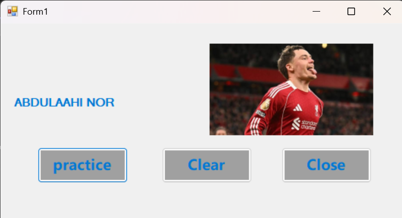
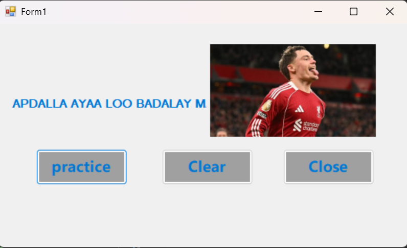
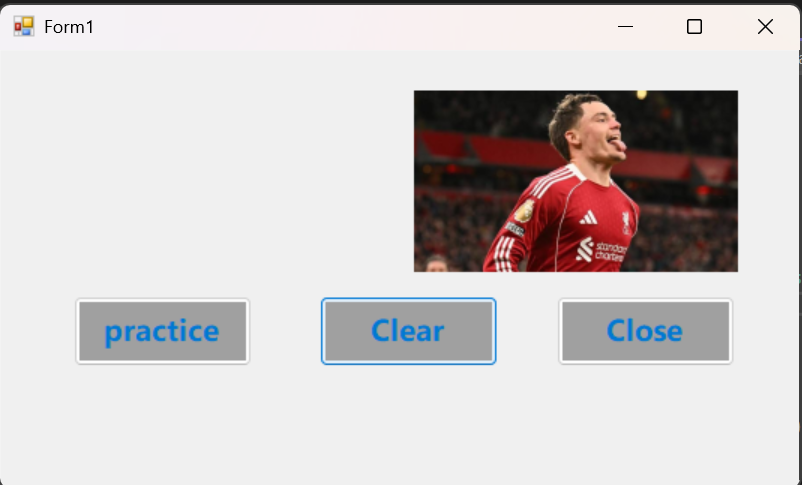

screenshot kaan waxaan ku practice gareeye, sida label looga badalo text ayadoo la isticmaalaayo 
buttons sawirka kore waa inta aa nan la taaban button ka Practice si uu labelka isku badalo

screenshot kaan waa marka practice button click la siiyay oo badal maday magaca abdulaahi nor

screenshot kaan waa qeebta Clear qoraalka awal ku qornaa labelka ayaa la clear gareeyay 

button ka close wuu xirmaa software ka daaran sidoo kale waxaan ku practice gareeye sida loo soo galiye sawir aydoo laga soo galinaayo 
pictureBox.

#  waxyaalaha design ka aan isticmaalay waxaa ka mid ah :

1. borderStyle
2. textAlignment
3. backColor and foreColor
4. name 
5. font

# Controls ka aan isticmaalay waxaa ka mid ah :

1. Button 
2. Label
3.PictureBox